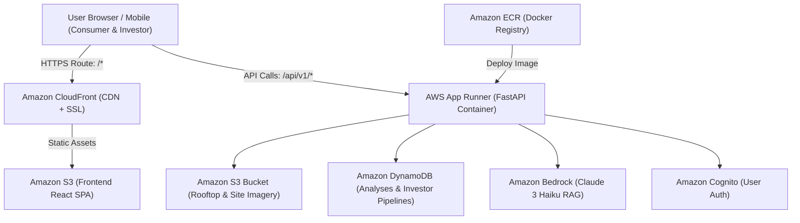

# 🚀 Complete AWS Deployment Guide: SuryaPunk Clean Energy Platform

This guide provides end-to-end instructions for deploying both **Part 1 (Individual Solar Sizing & Assessment)** and **Part 2 (Investor EV Hybrid Charging Platform)** to Amazon Web Services (AWS).

---

## 🏗️ Architecture Overview



| Component | AWS Service | Purpose |
| :--- | :--- | :--- |
| **Frontend** | Amazon S3 + CloudFront | High-performance, low-cost static React 19 hosting with global edge caching and free SSL |
| **Backend** | AWS App Runner | Fully managed container service for FastAPI; auto-scales, handles HTTPS, zero server management |
| **Container Registry**| Amazon ECR | Stores versioned Docker images |
| **Database** | Amazon DynamoDB | Low-latency NoSQL for solar analyses, quote history, and investor portfolios |
| **Object Storage** | Amazon S3 | Secure storage for rooftop satellite imagery and contracts |
| **AI RAG Assistant** | Amazon Bedrock | Managed Claude 3 Haiku for PM Surya Ghar and state solar intelligence |
| **Region** | `ap-south-1` (Mumbai) | Minimal latency for Indian users |

---

## 📋 Prerequisites

1. **AWS Account** with administrative or DevOps permissions.
2. **AWS CLI v2** installed and configured:
   ```bash
   aws configure
   # AWS Access Key ID [None]: YOUR_KEY
   # AWS Secret Access Key [None]: YOUR_SECRET
   # Default region name [None]: ap-south-1
   # Default output format [None]: json
   ```
3. **Docker Desktop** installed and running locally.
4. **Node.js 18+** & **Python 3.12+**.

---

## 🛠️ Step 1: Provision AWS Core Services (S3, DynamoDB, Bedrock)

### 1.1 Create S3 Buckets

We need two buckets:
1. One for backend rooftop images.
2. One for frontend static website files.

```bash
# 1. Backend storage bucket for rooftop uploads
aws s3api create-bucket \
    --bucket solarpunk-india-images-prod \
    --region ap-south-1 \
    --create-bucket-configuration LocationConstraint=ap-south-1

# Block public access on image bucket (private storage)
aws s3api put-public-access-block \
    --bucket solarpunk-india-images-prod \
    --public-access-block-configuration "BlockPublicAcls=true,IgnorePublicAcls=true,BlockPublicPolicy=true,RestrictPublicBuckets=true"

# 2. Frontend web hosting bucket
aws s3api create-bucket \
    --bucket suryapunk-web-prod \
    --region ap-south-1 \
    --create-bucket-configuration LocationConstraint=ap-south-1
```

### 1.2 Create DynamoDB Tables

Create the table for solar analyses and investor project pipelines:

```bash
# Solar Analyses Table
aws dynamodb create-table \
    --table-name solarpunk-analyses \
    --attribute-definitions \
        AttributeName=user_id,AttributeType=S \
        AttributeName=analysis_id,AttributeType=S \
    --key-schema \
        AttributeName=user_id,KeyType=HASH \
        AttributeName=analysis_id,KeyType=RANGE \
    --billing-mode PAY_PER_REQUEST \
    --region ap-south-1

# (For Part 2) Investor Projects & Allocations Table
aws dynamodb create-table \
    --table-name solarpunk-investor-pipeline \
    --attribute-definitions \
        AttributeName=project_id,AttributeType=S \
        AttributeName=investor_id,AttributeType=S \
    --key-schema \
        AttributeName=project_id,KeyType=HASH \
        AttributeName=investor_id,KeyType=RANGE \
    --billing-mode PAY_PER_REQUEST \
    --region ap-south-1
```

### 1.3 Enable Amazon Bedrock Claude 3 Access

1. Open the [AWS Bedrock Console](https://console.aws.amazon.com/bedrock/).
2. In the left navigation, choose **Model access**.
3. Click **Modify model access** or **Enable specific models**.
4. Check **Anthropic -> Claude 3 Haiku** (`anthropic.claude-3-haiku-20240307-v1:0`).
5. Submit the access request (approval is instantaneous in most regions).
*(Note: If Bedrock Claude is unavailable in `ap-south-1`, set `BEDROCK_REGION=us-east-1` in backend settings).*

---

## 🔐 Step 2: Create IAM Role for Backend

The backend container needs permissions to talk to S3, DynamoDB, and Bedrock.

### 2.1 Create Trust Policy (`apprunner-trust-policy.json`)

```json
{
  "Version": "2012-10-17",
  "Statement": [
    {
      "Effect": "Allow",
      "Principal": {
        "Service": "tasks.apprunner.amazonaws.com"
      },
      "Action": "sts:AssumeRole"
    }
  ]
}
```

Apply the role:
```bash
aws iam create-role \
    --role-name SuryaPunkBackendAppRunnerRole \
    --assume-role-policy-document file://apprunner-trust-policy.json
```

### 2.2 Attach Service Permissions Policy (`backend-policy.json`)

```json
{
  "Version": "2012-10-17",
  "Statement": [
    {
      "Sid": "S3Access",
      "Effect": "Allow",
      "Action": [
        "s3:PutObject",
        "s3:GetObject",
        "s3:ListBucket"
      ],
      "Resource": [
        "arn:aws:s3:::solarpunk-india-images-prod",
        "arn:aws:s3:::solarpunk-india-images-prod/*"
      ]
    },
    {
      "Sid": "DynamoDBAccess",
      "Effect": "Allow",
      "Action": [
        "dynamodb:PutItem",
        "dynamodb:GetItem",
        "dynamodb:Query",
        "dynamodb:Scan",
        "dynamodb:UpdateItem"
      ],
      "Resource": [
        "arn:aws:dynamodb:ap-south-1:*:table/solarpunk-analyses",
        "arn:aws:dynamodb:ap-south-1:*:table/solarpunk-investor-pipeline"
      ]
    },
    {
      "Sid": "BedrockInvoke",
      "Effect": "Allow",
      "Action": [
        "bedrock:InvokeModel"
      ],
      "Resource": "*"
    }
  ]
}
```

Attach to the role:
```bash
aws iam put-role-policy \
    --role-name SuryaPunkBackendAppRunnerRole \
    --policy-name SuryaPunkBackendPolicy \
    --policy-document file://backend-policy.json
```

---

## 🐳 Step 3: Build & Deploy Backend Container (ECR + AWS App Runner)

### 3.1 Create ECR Repository

```bash
ACCOUNT_ID=$(aws sts get-caller-identity --query Account --output text)
REGION="ap-south-1"

aws ecr create-repository \
    --repository-name suryapunk-backend \
    --region $REGION \
    --image-scanning-configuration scanOnPush=true
```

### 3.2 Authenticate Docker & Push Image

From your project root:
```bash
# Authenticate Docker to Amazon ECR
aws ecr get-login-password --region $REGION | docker login --username AWS --password-stdin $ACCOUNT_ID.dkr.ecr.$REGION.amazonaws.com

# Build Docker image
docker build -t suryapunk-backend:latest -f backend/Dockerfile backend/

# Tag image
docker tag suryapunk-backend:latest $ACCOUNT_ID.dkr.ecr.$REGION.amazonaws.com/suryapunk-backend:latest

# Push image to ECR
docker push $ACCOUNT_ID.dkr.ecr.$REGION.amazonaws.com/suryapunk-backend:latest
```

### 3.3 Create AWS App Runner Service

App Runner provides automatic container builds, zero-downtime rolling deploys, auto-scaling, and a free SSL endpoint (`https://xxxx.awsapprunner.com`).

Create `apprunner-service.json`:
```json
{
  "ServiceName": "suryapunk-api",
  "SourceConfiguration": {
    "ImageRepository": {
      "ImageIdentifier": "YOUR_ACCOUNT_ID.dkr.ecr.ap-south-1.amazonaws.com/suryapunk-backend:latest",
      "ImageRepositoryType": "ECR",
      "ImageConfiguration": {
        "Port": "8000",
        "RuntimeEnvironmentVariables": {
          "AWS_REGION": "ap-south-1",
          "S3_BUCKET_NAME": "solarpunk-india-images-prod",
          "DYNAMODB_TABLE_NAME": "solarpunk-analyses",
          "BEDROCK_MODEL_ID": "anthropic.claude-3-haiku-20240307-v1:0",
          "CORS_ORIGINS": "*"
        }
      }
    },
    "AutoDeploymentsEnabled": true
  },
  "InstanceConfiguration": {
    "Cpu": "1024",
    "Memory": "2048",
    "InstanceRoleArn": "arn:aws:iam::YOUR_ACCOUNT_ID:role/SuryaPunkBackendAppRunnerRole"
  }
}
```
*(Replace `YOUR_ACCOUNT_ID` with your actual 12-digit AWS account number).*

Launch the service:
```bash
aws apprunner create-service --cli-input-json file://apprunner-service.json
```

Once deployment completes (approx 3 minutes), retrieve your service URL:
```bash
aws apprunner list-services --query "ServiceSummaryList[?ServiceName=='suryapunk-api'].ServiceUrl" --output text
```
Example Output: `https://abcd1234efgh.ap-south-1.awsapprunner.com`

**Verify Backend:**
```bash
curl https://abcd1234efgh.ap-south-1.awsapprunner.com/
# Expected: {"status":"ok","message":"SolarPunk India API is running"}
```

---

## ⚡ Step 4: Build & Deploy Frontend (S3 + CloudFront)

### 4.1 Update Frontend API URL

Create or update `.env.production` in the project root:
```env
VITE_API_URL=https://abcd1234efgh.ap-south-1.awsapprunner.com
```

### 4.2 Build Frontend Production Bundle

```bash
npm run build
```
This produces the optimized production bundle in the `dist/` directory.

### 4.3 Upload to S3 Frontend Bucket

```bash
aws s3 sync dist/ s3://suryapunk-web-prod --delete
```

### 4.4 Set Up CloudFront Distribution (HTTPS & SPA Routing)

CloudFront distributes the React application globally, handles HTTPS certificates, and routes all client-side paths to `index.html`.

Create `cloudfront-config.json`:
```json
{
  "CallerReference": "suryapunk-prod-1",
  "Comment": "SuryaPunk Web Platform",
  "DefaultRootObject": "index.html",
  "Origins": {
    "Quantity": 1,
    "Items": [
      {
        "Id": "S3-suryapunk-web-prod",
        "DomainName": "suryapunk-web-prod.s3.ap-south-1.amazonaws.com",
        "S3OriginConfig": {
          "OriginAccessIdentity": ""
        }
      }
    ]
  },
  "DefaultCacheBehavior": {
    "TargetOriginId": "S3-suryapunk-web-prod",
    "ViewerProtocolPolicy": "redirect-to-https",
    "AllowedMethods": {
      "Quantity": 2,
      "Items": ["GET", "HEAD"],
      "CachedMethods": {
        "Quantity": 2,
        "Items": ["GET", "HEAD"]
      }
    },
    "ForwardedValues": {
      "QueryString": false,
      "Cookies": { "Forward": "none" }
    },
    "MinTTL": 0,
    "DefaultTTL": 86400,
    "MaxTTL": 31536000
  },
  "CustomErrorResponses": {
    "Quantity": 1,
    "Items": [
      {
        "ErrorCode": 403,
        "ResponsePagePath": "/index.html",
        "ResponseCode": "200",
        "ErrorCachingMinTTL": 10
      },
      {
        "ErrorCode": 404,
        "ResponsePagePath": "/index.html",
        "ResponseCode": "200",
        "ErrorCachingMinTTL": 10
      }
    ]
  },
  "Enabled": true
}
```

Create distribution:
```bash
aws cloudfront create-distribution --distribution-config file://cloudfront-config.json
```
Note the resulting CloudFront Domain Name (e.g. `d12345abcdef.cloudfront.net`).

---

## 🤝 Step 5: Integrating Part 2 (Investor EV Platform)

Your project is built with clean modular separation so your teammate's work plugs in without merge conflicts:

### 5.1 Backend Modular Router

In `backend/routers/investor.py` (your teammate creates this):
```python
from fastapi import APIRouter
from pydantic import BaseModel

router = APIRouter(prefix="/api/v1/investor", tags=["Investor EV Platform"])

class EVProject(BaseModel):
    project_id: str
    title: str
    target_irr: float
    capacity_kw: float
    fast_chargers_count: int

@router.get("/projects")
def list_ev_projects():
    # Reads from DynamoDB table 'solarpunk-investor-pipeline'
    return []
```

Include in `backend/main.py`:
```python
from routers.investor import router as investor_router
app.include_router(investor_router)
```

### 5.2 Frontend Routing

In `src/App.tsx`, toggle between:
* `currentRoute === 'app'`: Individual Solar Sizing (`SolarApp.tsx`)
* `currentRoute === 'investor'`: Investor EV Platform (your teammate's component)

---

## 🔄 Step 6: Automated CI/CD (GitHub Actions)

Create `.github/workflows/deploy.yml` in your GitHub repository for automated deployment on every `git push`:

```yaml
name: Deploy SuryaPunk to AWS

on:
  push:
    branches: [ main ]

jobs:
  deploy-backend:
    runs-on: ubuntu-latest
    steps:
      - uses: actions/checkout@v4
      - name: Configure AWS Credentials
        uses: aws-actions/configure-aws-credentials@v4
        with:
          aws-access-key-id: ${{ secrets.AWS_ACCESS_KEY_ID }}
          aws-secret-access-key: ${{ secrets.AWS_SECRET_ACCESS_KEY }}
          aws-region: ap-south-1

      - name: Log in to Amazon ECR
        id: login-ecr
        uses: aws-actions/amazon-ecr-login@v2

      - name: Build and Push Docker image
        run: |
          docker build -t ${{ steps.login-ecr.outputs.registry }}/suryapunk-backend:latest -f backend/Dockerfile backend/
          docker push ${{ steps.login-ecr.outputs.registry }}/suryapunk-backend:latest

  deploy-frontend:
    runs-on: ubuntu-latest
    steps:
      - uses: actions/checkout@v4
      - name: Set up Node.js
        uses: actions/setup-node@v4
        with:
          node-version: 20

      - name: Install dependencies & Build
        env:
          VITE_API_URL: ${{ secrets.PROD_API_URL }}
        run: |
          npm ci
          npm run build

      - name: Configure AWS Credentials
        uses: aws-actions/configure-aws-credentials@v4
        with:
          aws-access-key-id: ${{ secrets.AWS_ACCESS_KEY_ID }}
          aws-secret-access-key: ${{ secrets.AWS_SECRET_ACCESS_KEY }}
          aws-region: ap-south-1

      - name: Sync S3 & Invalidate CloudFront
        run: |
          aws s3 sync dist/ s3://suryapunk-web-prod --delete
          aws cloudfront create-invalidation --distribution-id ${{ secrets.CLOUDFRONT_DISTRIBUTION_ID }} --paths "/*"
```

---

## 🎯 Production Verification Checklist

- [ ] **Backend Health Check**: `https://<apprunner-domain>/` returns `{"status":"ok"}`.
- [ ] **RAG Chatbot**: Test `POST /api/v1/consumer/chat` to verify Bedrock response.
- [ ] **Map & Rooftop Computer Vision**: Test `POST /api/v1/consumer/detect-rooftop` with Indian coordinates (e.g. Bangalore `12.9784, 77.6408`).
- [ ] **Frontend HTTPS**: CloudFront domain serves `https://` with green padlock.
- [ ] **Client-Side Routing**: Navigating to deep routes doesn't trigger 404 (handled by CloudFront SPA custom error response).
- [ ] **Teammate Integration Ready**: Investor route and API endpoints ready for Part 2 plug-in.
